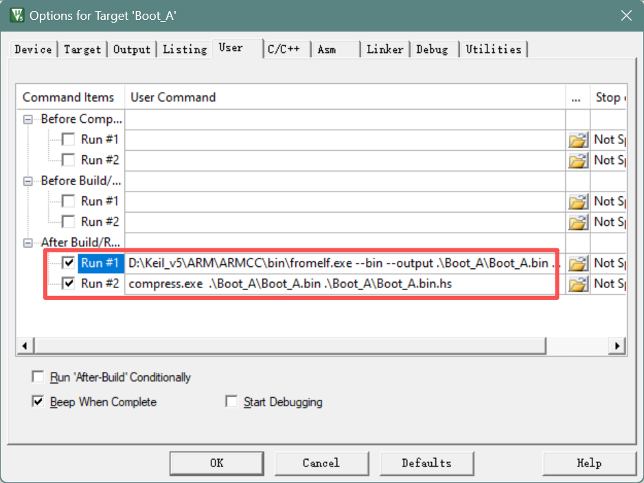
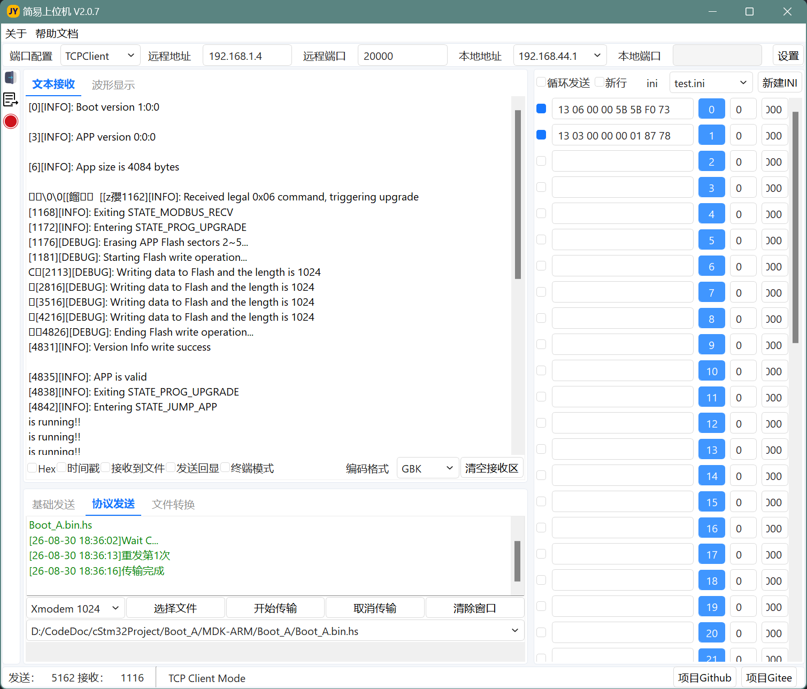

# Boot_B — STM32F401 IAP 引导加载程序

基于 STM32F401CCU6 的双区 IAP Bootloader，通过 **Modbus RTU + XMODEM-CRC** 接收 **HeatShrink 压缩固件**并在线烧写升级。

## 硬件

| 项目 | 参数 |
|------|------|
| MCU | STM32F401CCU6（Cortex-M4F @ 84 MHz，HSE 25 MHz→PLL） |
| Flash / SRAM | 256 KB / 64 KB |
| 通信 | USART1 @ 115200 8N1（PA9 TX / PA10 RX，DMA 空闲中断接收） |
| 指示灯 | PC13（LD0），按 FSM 状态变频闪烁 |

## Flash 布局

```
0x08000000 ┌──────────────┐
           │ Boot (32 KB) │  扇区 0~1
0x08008000 ├──────────────┤  ← APP 起始地址
           │ App (224 KB) │  扇区 2~5
0x08040000 └──────────────┘
```

- APP 有效性：`APP_ADDR + 408` 处魔数 `0x5A5A`
- Boot/APP 版本信息、固件长度存于 Flash 末尾 64 字节

## 升级流程

1. 上位机 Modbus FC06 写入触发寄存器（`holding_regs[0] = 0x5B5B`，且读写计数器 > 0），APP 版本写入 `holding_regs[1..3]`
2. 进入升级状态 → 擦除扇区 2~5 → 发送 `'C'` 启动 XMODEM-CRC 接收
3. 固件为 **HeatShrink 压缩格式**（首 4 字节小端为解压后长度），边解压边写入 Flash（字写入 + 回读校验）
4. 收到 EOT → 冲刷解压缓存 → 写入版本信息 → 校验魔数
5. 校验通过 → 设置 VTOR → 跳转 APP

超时（10 s）未收到指令且 APP 有效时，自动跳转 APP。

## 状态机

| 状态 | 说明 | LED |
|------|------|-----|
| `STATE_MODBUS_RECV` | 等待 Modbus 指令 | 50 ms 快闪 |
| `STATE_PROG_UPGRADE` | XMODEM 接收 + 解压烧写 | 100 ms 中速闪 |
| `STATE_JUMP_APP` | 跳转 APP | 500 ms 慢闪 |

## 关键参数

| 参数 | 值 | 位置 |
|------|-----|------|
| BOOT / APP 区 | 32 KB / 224 KB，APP 起始 `0x08008000` | `BootLoader.h` |
| APP 魔数 | `0x5A5A` @ `0x08008198` | `BootLoader.h` |
| Modbus 从站地址 | 19（FC03 读 / FC06 写） | `main.c` |
| FSM 超时 | 10 s | `fsm_bootloader.c` |
| XMODEM 超时 / 重试 | 2000 ms / 5 次（128 B / 1024 B 包） | `main.c` |

## 目录结构

```
Application/
├── BootLoader/    # Flash 擦写、解压烧写、版本信息、跳转 APP
├── Fsm/           # 状态机引擎 + 状态行为（Entry/Do/Exit）
├── ModbusRTU/     # Modbus RTU 从站（CRC16、FC03/FC06）
├── Xmodem/        # XMODEM-CRC 接收器（DMA 环形缓冲）
├── HeatShrink/    # heatshrink 解压器 + boot_decode 流式解压
└── ULOG/          # 轻量级日志库（USART1 打印）
Core/              # HAL 配置、main.c、时钟、外设初始化
MDK-ARM/           # Keil MDK uVision5 工程
```

## APP工程压缩bin生成方式

将 `compress.exe` 放入APP工程目录，在User的After Build 中添加指令

```
compress.exe  .\Boot_A\Boot_A.bin .\Boot_A\Boot_A.bin.hs
```



编译后会自动生成压缩文件
```shell
Build target 'Boot_A'
FromELF: creating hex file...
After Build - User command #1: D:\Keil_v5\ARM\ARMCC\bin\fromelf.exe --bin --output .\Boot_A\Boot_A.bin .\Boot_A\Boot_A.axf
After Build - User command #2: compress.exe  .\Boot_A\Boot_A.bin .\Boot_A\Boot_A.bin.hs
.\Boot_A\Boot_A.bin: 4084 -> 3279 bytes (80.3%)
".\Boot_A\Boot_A.axf" - 0 Error(s), 1 Warning(s).
```

**注意**：APP程序一定要写入魔数
```c
#define BOOT_SIZE 0x8000U
// 魔数位置设置
#define LAST_IRQn           SPI4_IRQn   // 最后一个中断向量
#define VECT_TABLE_SIZE     ((1 + 16 + ((LAST_IRQn) + 1)) * 4) // 408
#define MAGIC_ADDR          (FLASH_BASE + BOOT_SIZE + VECT_TABLE_SIZE)     // 0x08000198
const uint32_t __attribute__((at(MAGIC_ADDR))) magic = 0x5A5A;
```

## 下载上位机

[JYSWJ](https://github.com/snqx-lqh/JYSWJ) 

